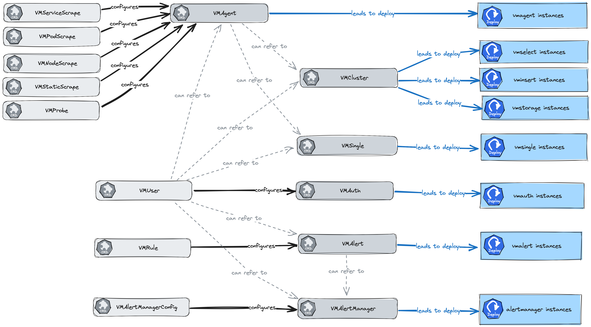

# Victoria Metrics Scrapes Helm Chart for deploying CRDs for scraping by vmagent

Creates like kinds VMServiceScrape, VMNodeScrape, VMPodScrape and VMStaticScrapes

## Prerequisites Details
* [Victoria Metrics helm repository](https://docs.victoriametrics.com/operator/resources/) is added.

Documentation by VM [Custom resource kinds](https://docs.victoriametrics.com/operator/resources/)

## Chart Details
please see at default values.yaml like an example

